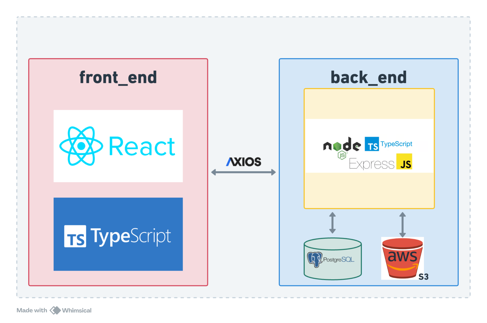

# TravelMap

## 技術說明

### 後端

-   框架：`Node.js Express`
-   `RESTful API & MVC` 架構
-   使用`Typescript` 開發

### 資料庫

-   `PostgreSql`

### 雲端服務

-   `AWS S3`

### 前端

-   框架：`React`
-   `Saas`
-   使用`Typescript`開發

### 系統架構

### 操作影片

https://github.com/Robert12280/travelMap/assets/80948837/8a17087f-f707-4e83-a5f7-895a53757ce9

